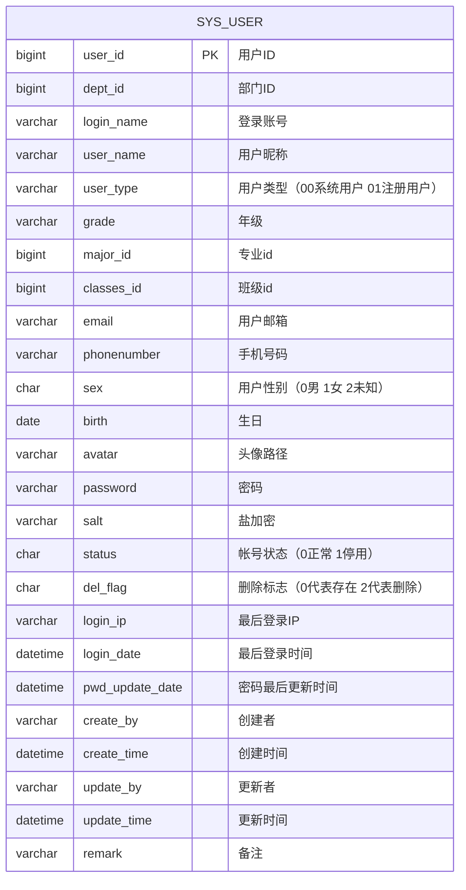

```mermaid
erDiagram
    SYS_USER {
        bigint user_id PK "用户ID"
        bigint dept_id "部门ID"
        varchar login_name "登录账号"
        varchar user_name "用户昵称"
        varchar user_type "用户类型（00系统用户 01注册用户）"
        varchar grade "年级"
        bigint major_id "专业id"
        bigint classes_id "班级id"
        varchar email "用户邮箱"
        varchar phonenumber "手机号码"
        char sex "用户性别（0男 1女 2未知）"
        date birth "生日"
        varchar avatar "头像路径"
        varchar password "密码"
        varchar salt "盐加密"
        char status "帐号状态（0正常 1停用）"
        char del_flag "删除标志（0代表存在 2代表删除）"
        varchar login_ip "最后登录IP"
        datetime login_date "最后登录时间"
        datetime pwd_update_date "密码最后更新时间"
        varchar create_by "创建者"
        datetime create_time "创建时间"
        varchar update_by "更新者"
        datetime update_time "更新时间"
        varchar remark "备注"
    }
```