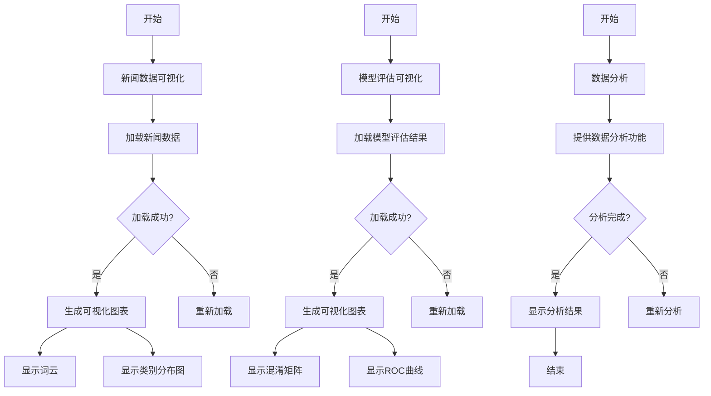

```mermaid
graph TD
    Start[开始] --> A[新闻数据可视化]
    A --> B[加载新闻数据]
    B --> C{加载成功?}
    C -->|是| D[生成可视化图表]
    C -->|否| E[重新加载]
    D --> F[显示词云]
    D --> G[显示类别分布图]

    Start2[开始] --> H[模型评估可视化]
    H --> I[加载模型评估结果]
    I --> J{加载成功?}
    J -->|是| K[生成可视化图表]
    J -->|否| L[重新加载]
    K --> M[显示混淆矩阵]
    K --> N[显示ROC曲线]

    Start3[开始] --> O[数据分析]
    O --> P[提供数据分析功能]
    P --> Q{分析完成?}
    Q -->|是| R[显示分析结果]
    Q -->|否| S[重新分析]
    R --> End[结束]
```