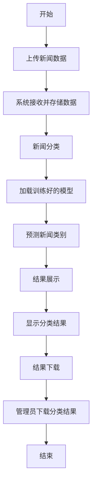

```mermaid
graph TD
    Start[开始] --> A[上传新闻数据]
    A --> B[系统接收并存储数据]
    B --> C[新闻分类]
    C --> D[加载训练好的模型]
    D --> E[预测新闻类别]
    E --> F[结果展示]
    F --> G[显示分类结果]
    G --> H[结果下载]
    H --> I[管理员下载分类结果]
    I --> End[结束]
```