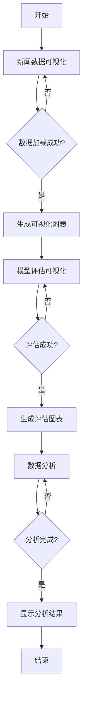

```mermaid
graph TD
    Start[开始] --> A[新闻数据可视化]
    A --> B{数据加载成功?}
    B -->|是| C[生成可视化图表]
    B -->|否| A
    C --> D[模型评估可视化]
    D --> E{评估成功?}
    E -->|是| F[生成评估图表]
    E -->|否| D
    F --> G[数据分析]
    G --> H{分析完成?}
    H -->|是| I[显示分析结果]
    H -->|否| G
    I --> End[结束]
```