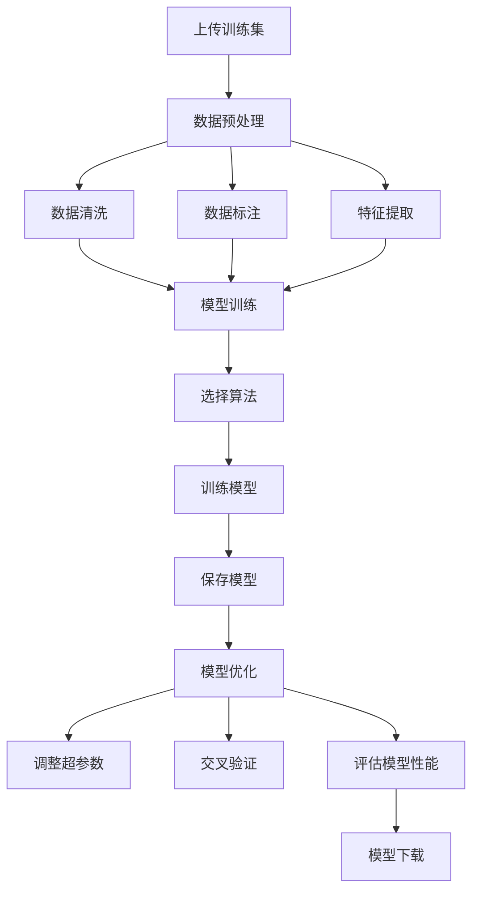

```mermaid
graph TD
    A[上传训练集] --> B[数据预处理]
    B --> C[数据清洗]
    B --> D[数据标注]
    B --> E[特征提取]
    C --> F[模型训练]
    D --> F[模型训练]
    E --> F[模型训练]
    F --> G[选择算法]
    G --> H[训练模型]
    H --> I[保存模型]
    I --> J[模型优化]
    J --> K[调整超参数]
    J --> L[交叉验证]
    J --> M[评估模型性能]
    M --> N[模型下载]
```