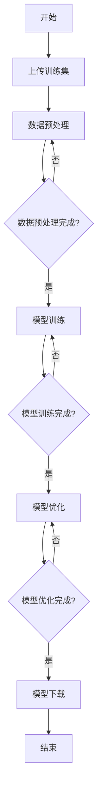

```mermaid
graph TD
    Start[开始] --> A[上传训练集]
    A --> B[数据预处理]
    B --> C{数据预处理完成?}
    C -->|是| D[模型训练]
    C -->|否| B
    D --> E{模型训练完成?}
    E -->|是| F[模型优化]
    E -->|否| D
    F --> G{模型优化完成?}
    G -->|是| H[模型下载]
    G -->|否| F
    H --> End[结束]
```