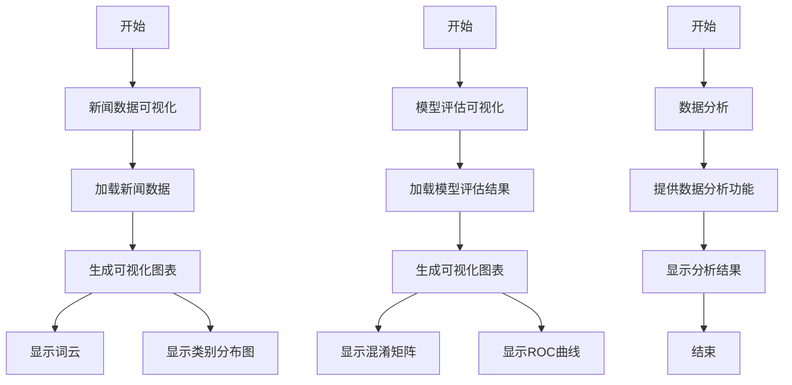

```mermaid
graph TD
    Start[开始] --> A[新闻数据可视化]
    A --> B[加载新闻数据]
    B --> C[生成可视化图表]
    C --> D[显示词云]
    C --> E[显示类别分布图]

    Start2[开始] --> F[模型评估可视化]
    F --> G[加载模型评估结果]
    G --> H[生成可视化图表]
    H --> I[显示混淆矩阵]
    H --> J[显示ROC曲线]

    Start3[开始] --> K[数据分析]
    K --> L[提供数据分析功能]
    L --> M[显示分析结果]
    M --> End[结束]
```